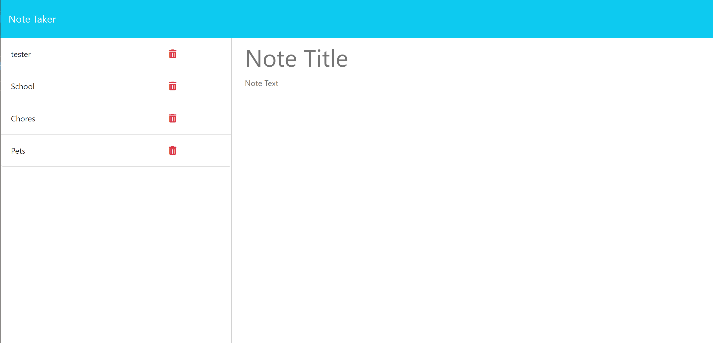
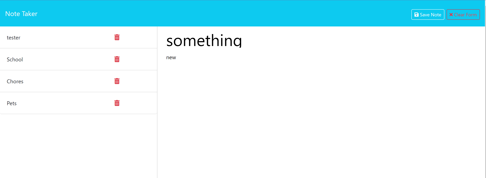

# notes-application

For this assignment, I was instructed to create a Note Taking application that uses Express.js and also saves the notes entered into local storage. I also added a delete feature so the user may delete their notes as well.

## USER STORY 

AS the user
I WANT to use a note taking application 
SO THAT I can enter any notes i need to keep track of and also have the ability to delete any notes I no longer need

## ACCEPTANCE CRITERIA

GIVEN I am using a Note Taking application
WHEN I open the application 
THEN I can see the notes I have already inputed on the left side of the application
WHEN I want to add another note I can enter one on the right side of the application
THEN I am presented with a Save Note button 
WHEN I click the button 
THEN my saved note appears on the right side
WHEN I am ready to delete my note
THEN I can click the trash icon button to delete the note

## MOCK UP 

## LINKS 
http://localhost:3001/notes?
